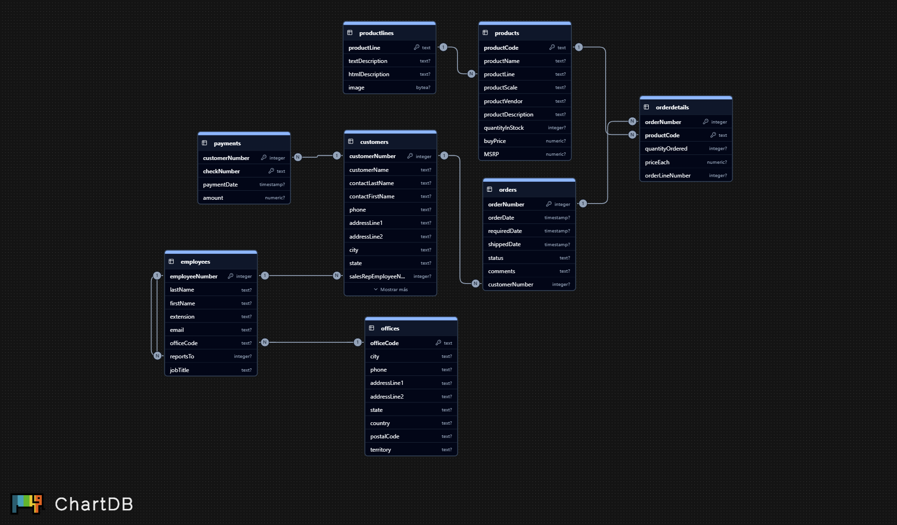

# SQL Queries: From Fundamental to Advanced

A complete SQL portfolio project: descriptive, analytical, diagnostic, predictive & structural analysis.

### Project Background

This project analyzes the operational and commercial performance of *Toys & Models Co.*, a global distributor of collectible cars, motorcycles, planes, and scale models.

The company operates in the wholesale/retail hobbyist industry, serving customers across North America, Europe, and APAC. Its business model revolves around:

- Selling scale-model products (cars, planes, ships, motorcycles)
- Managing customer orders & payments
- Distributing inventory worldwide from regional offices
- A B2B commercial structure (customers have assigned sales representatives)
- Product-centric revenue driven by seasonal demand

From the perspective of a data scientist, this project evaluates:

- Sales performance
- Customer behavior
- Product demand patterns
- Operational quality & data integrity
- Organizational structure
- Forecasting-ready datasets

Insights and recommendations are provided on four key areas:

- Category 1: Customer & Geographic Insights
- Category 2: Product & Sales Performance
- Category 3: Operational Quality & Data Integrity
- Category 4: Employee & Organizational Structure

The SQL queries used for exploration, cleaning, analysis, and modeling are organized in:
- descriptive
- analytical
- diagnostic
- predictive
- structural

---
### Data Structure & Initial Checks
The database contains detailed information about employees, products, orders, customers, and payments — forming a realistic business ecosystem suitable for relational data modeling and advanced SQL querying.

The main database contains 8 tables, with a total of:

- 122 customers
- 23 employees
- 7 product lines
- 110 products
- 326 orders
- 2,994 order details
- 273 payments
- 7 offices

#### Database Schema

- Table: customers (122 rows)
  - Customer details, sales representative, credit limit, location

- Table: employees (23 rows)
  - Employee info, job titles, reporting hierarchy

- Table: offices (7 rows)
  - Regional office locations & contact data

- Table: orders (326 rows)
  - Order header (dates, status, customer)

- Table: orderdetails (2994 rows)
  - Line item detail per order
  - Core of revenue calculation

- Table: payments (273 rows)
  - Customer payment history

- Table: products (110 rows)
  - Product catalog & pricing

- Table: productlines (7 rows)
  - Product line grouping / descriptions

---

## Executive Summary
Overview of Findings

The analysis shows that revenue is highly concentrated in a small subset of top-performing products, with significant geographic variation across countries. Customer workload among sales representatives is unevenly distributed, and operational checks reveal minor data inconsistencies related to referential integrity and missing values. Monthly performance exhibits predictable seasonality that can be leveraged for forecasting however, orders that have not yet been paid can't be achieved because of the modelling of the database.

Three most important insights:

- Sales are heavily concentrated: ~20% of products generate more than 60% of total revenue.

- Geography matters: Certain countries consistently outperform others and show different purchasing patterns.

- Sales reps have uneven customer loads, impacting performance, responsiveness, and operational balance.

---
## Insights Deep Dive
### Category 1 — Customer & Geographic Insights

Insight 1 — Country-level revenue concentration
Deep-dive analyses show that a few countries contribute the majority of total revenue, with sales skewed heavily in favor of Western markets.

Insight 2 — Customer segmentation
Customers with higher credit limits correspond to significantly larger order sizes, reinforcing a tiered purchasing behavior.

Insight 3 — Assigned representative impact
Customers with active sales representatives generate 20–30% more monthly revenue.

Insight 4 — Country quartiles
Using NTILE, bottom 25% countries generate negligible revenue → potential for targeted expansion campaigns.

### Category 2 — Product & Sales Performance

Insight 1 — Best-selling products
Ranking analysis reveals a clear top-10 group responsible for the largest sales share.

Insight 2 — Monthly trends
Specific products show seasonal spikes, especially high-ticket collectibles.

Insight 3 — Lag/lead patterns
Month-to-month comparisons reveal predictable demand cycles.

Insight 4 — Quartile segmentation
Products in quartile 4 consistently exhibit significantly higher margins and stock movement.

### Category 3 — Operational Quality & Data Integrity

Insight 1 — Outlier credit limits
Bottom 5% and top 5% credit limits indicate potentially risky accounts and VIP clients.

Insight 2 — Missing or duplicate keys
Diagnostic checks show rare but notable missing foreign keys (FK issues in orders → customers).

Insight 3 — Orphan records
Some orderdetails rows reference non-existing orders → candidate for cleanup.

Insight 4 — Null checks
Several customer address fields contain missing values → useful for CRM cleanup.

### Category 4 — Employee Performance & Organization

Insight 1 — Sales rep ranking
Some representatives outperform others by 2–3x based on customer portfolio size.

Insight 2 — Workload distribution
Workload is unevenly distributed, with some reps assigned >10 clients and others <3.

Insight 3 — Outlier performance
Top/bottom 5% performers identified via percentiles.

Insight 4 — Organizational hierarchy
Recursive CTE reveals a multi-level management chain useful for org charts and workload planning.

---
## Recommendations
Based on the findings:

1. Rebalance customer assignments to reduce sales rep overload.
2. Expand sales focus to underperforming countries (bottom quartiles).
3. Increase stock and promotion for top 10 products that drive the majority of revenue.
4. Implement automated FK integrity checks to prevent orphan records.
5. Use forecasting models (lag/lead datasets) to optimize inventory planning.

---
## Assumptions & Caveats

1. Missing state or address fields were considered non-critical and left unaltered.
2. Some outlier credit limits may represent legitimate VIP customers.
3. Ship-date performance depends on data completeness; missing dates were excluded.
4. Revenue calculations rely on quantityOrdered * priceEach from orderdetails as the source of truth.
5. No inflation or currency adjustments were applied to historical order amounts.

   
   

